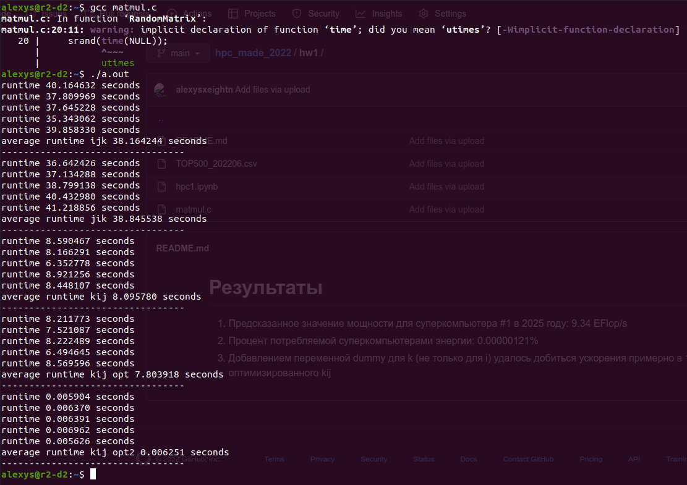

# Условия

50% На основании данных рейтинга top500 спрогнозировать  производительность компьютера №1 в 2025

50% оцените какой процент всего производимого на Земле электричества потребляют все компьютеры из top500 (на основании открытых данных top500.org)

10% Бонус: Улучшить производительность программы с реализацией алгоритма матричного умножения (сниппет https://bit.ly/339RAhp )

# Результаты

1. Предсказанное значение мощности для суперкомпьютера #1 в 2025 году: 9.34 EFlop/s
2. Процент потребляемой суперкомпьютерами энергии: 0.00000121%
3. Добавлением переменной dummy для k (не только для i) удалось добиться ускорения примерно в 1000 раз относительно оптимизированного kij

