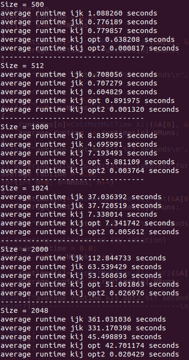

# Условия

1. Реализовать классическое перемножение матриц и умножение матрицы на вектор на C/C++ с разным порядком циклов (25\%)
2. Разбейте на модули, со статической линковкой скомпилируйте текст, подготовьте Makefile, проверьте флаги -g,  -O3  (25\%)\\
3. Измерьте времена исполнения для размеров $N = 500, 512, 1000, 1024, 2000, 2048$  (25\%)
В т.ч. проведите сравнение с виртуальной машиной, докером (опционально)
4. И базовые скрипты баш  (25\%)
5. Бонус за линпак(+20\%)
6. Супербонус протестируйте алгоритм Штрассена   (+20\%)

# Результаты

1. [matmul.c](matmul.c) - код перемножения матриц
2. Были измерены времена исполнения, результаты на изображении ниже. Умножение матриц 512 на 512 происходит быстрее, чем умножение матриц 500 на 500, однако обратное происходит для матриц 1000 на 1000 и 1024 на 1024 и для матриц 2000 на 2000 и 2048 на 2048, причем разница существенна для порядков ijk и jik и менее существенна для kij.
3. Скрипты баш находятся [здесь](./bash_scripts)

