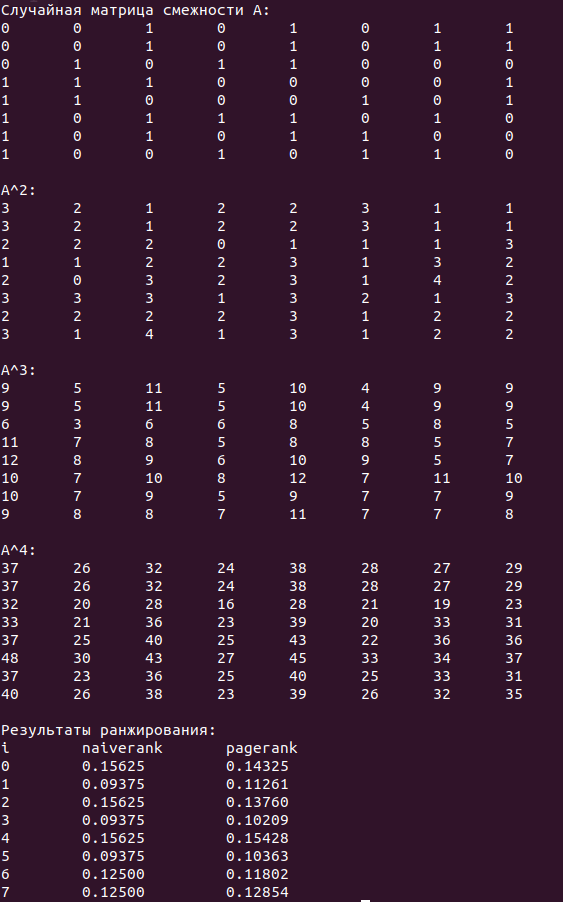

# Условия

-- Сгенерируйте случайные графы и протестируйте пересчет числа маршрутов в графе через вычисление степени матрицы связности $A^m$. Реализуйте через быстрое возведение в степень за $log_2(m)$ матричных умножений (30 %).

-- Сгенерируйте (или предложите) небольшой случайный граф и реализуйте процедуру вычисления вектора Pagerank. Сопоставьте с наивным ранжированием по числу входящих ссылок ranking (40 %).

Tip: Moscow subway graph is a nice example (but rather tiny). 

-- Воспользуйтесь всеми трюками по оптимизации производительности: optimization, blas, openmp, loops placing (30 %)

-- Research-ориентированным людям рекомендуется изучить SimRank (вне оценивания, но стоит упоминания)

# Результаты

Для оптимизации использовались ```blas```, ```openmp``` и грамотная работа с циклами

Запуск производится командой ```gcc matrix_power_n_pagerank.c -lblas```

Вывод программы:


