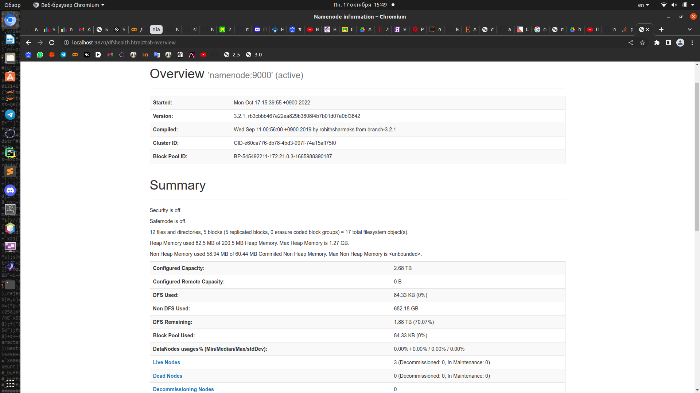
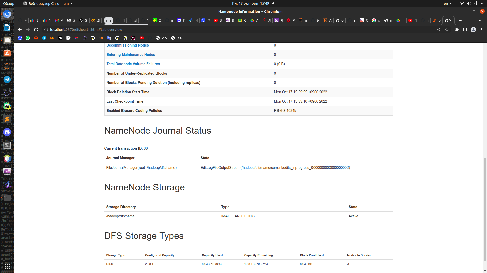
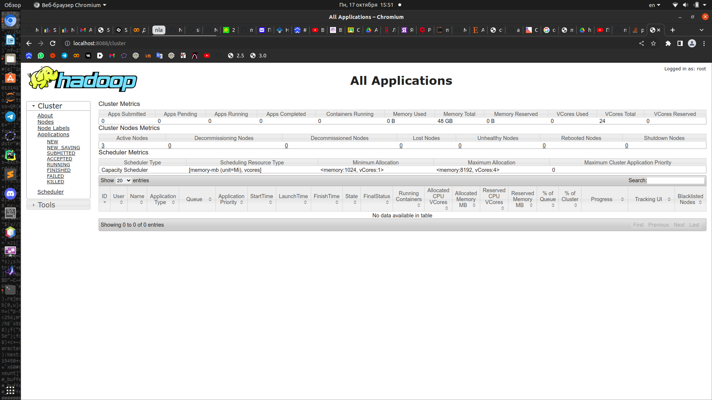

[Условия](./hw01-hdfs.pdf)

# Блок 1. Развертывание локального кластера Hadoop

[yaml-конфиг](./docker-compose.yml) для поднятия кластера с конфигурацией, данной в задании

Скриншоты NN:

Скриншот RM:

# Блок 2. Работа с HDFS

Все команды находятся [здесь](./hdfs.txt)

# Блок 3. Написание map reduce на Python

[Подсчет стандартными способами](./without_mapreduce.ipynb)

[Маппер для среднего](./mapper_mean.py), [редюсер для среднего](./reducer_mean.py), [маппер для дисперсии](./mapper_var.py), [редюсер для дисперсии](./reducer_var.py)

Запуск mapreduce задач производится с помощью [bash-скрипта](./mapred.sh)

Сравнение результатов:

|          | mapreduce          | стандартный расчет |
|----------|--------------------|--------------------|
| mean     | 152.72068718682894 | 152.7206871868289  |
| variance | 57675.206594263975 | 57674.02524696099  |

Неточность подсчета с помощью mapreduce может быть обусловлена большим количеством делений, которые создают погрешность вычисления.
