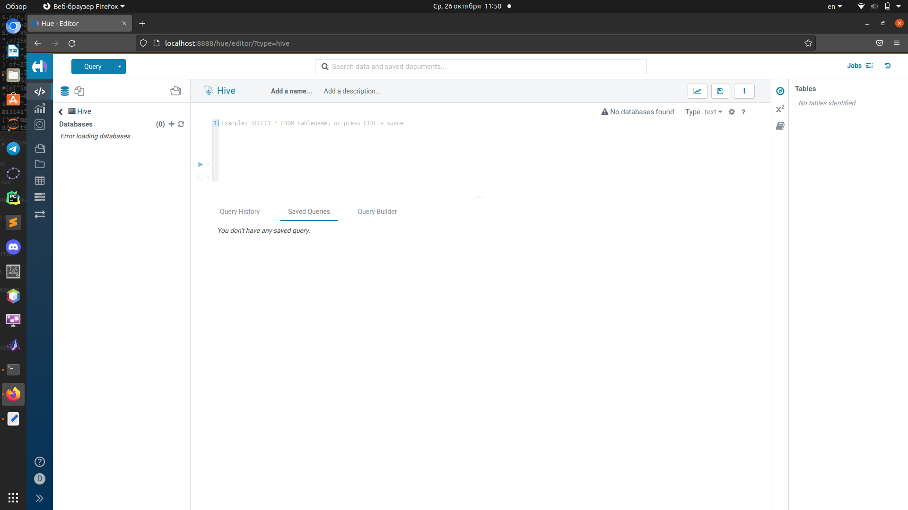
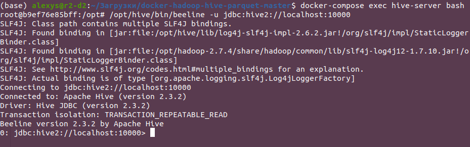
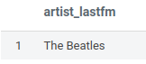
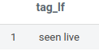
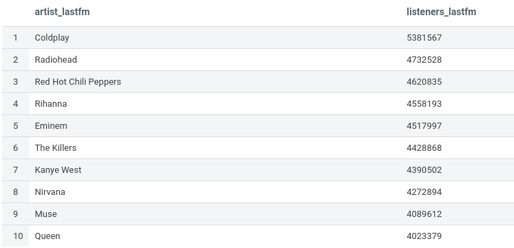
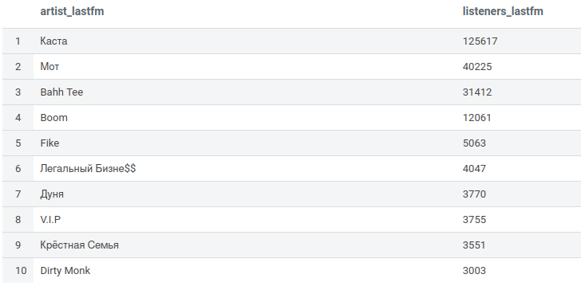

# Блок 1. Развертывание локального Hive

Для развертывания использовался https://github.com/tech4242/docker-hadoop-hive-parquet

Hue:



Beeline:



# Блок 2. Работа с Hive

Для загрузки датасета в Hive сначала файл был скопирован на сервер:
```
docker cp artists.csv docker-hadoop-hive-parquet-master_hive-server_1:/opt
```

А затем добавлен с помощью [hql-скрипта](create_table.hql)

**Запросы:**

[Исполнитель с максимальным числом скробблов](query1.hql)

Результат:



[Самый популярный тэг на ластфм](query2.hql)

Результат:



[Самые популярные исполнители 10 самых популярных тегов ластфм](query3.hql)

Результат:



[Самые популярные исполнители русского рэпа](query4.hql) (инсайт на своё усмотрение)

Результат:


