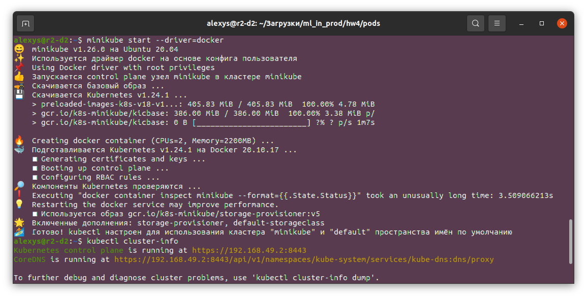
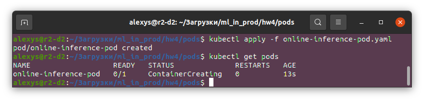

# Машинное обучение в продакшене. ДЗ 4

## Хмелёв Алексей, MADE-DS-22

### Установка `kubectl`:

```
curl -LO https://storage.googleapis.com/kubernetes-release/release/`curl -s https://storage.googleapis.com/kubernetes-release/release/stable.txt`/bin/linux/amd64/kubectl
chmod +x ./kubectl
sudo mv ./kubectl /usr/local/bin/kubectl
```

### Развернуть k8s (`minikube`):

```
curl -LO https://storage.googleapis.com/minikube/releases/latest/minikube-linux-amd64
sudo install minikube-linux-amd64 /usr/local/bin/minikube
minikube start --driver=docker
```



### Деплой приложений:

```
kubectl apply -f <filename>.yaml
```

Пример деплоя `online-inference-pod.yaml`:



В поде `online-inference-pod-resources.yaml` прописаны Requests и Limits для того, чтобы приложения адекватно использовали ресурсы сервера (requests - нижняя граница, настраивается так, чтобы у приложения не было нехватки ресурсов; limits - верхняя граница, настраивается так, чтобы приложение могло работать при пиковой нагрузке)

### Баллы:

#### Основная часть: 
1. Разверните Kubernetes (5/5)
2. Напишите простой Pod manifest для вашего приложения, назовите его `online-inference-pod.yaml` (4/4)
3. Пропишите Requests / Limits и напишите, зачем это нужно в описании PR. Закоммитьте файл online-inference-pod-resources.yaml (2/2)
4. Модифицируйте свое приложение так, чтобы оно стартовало не сразу (с задержкой 20-30 секунд) и падало спустя минуты работы. Добавьте Liveness и Readiness пробы и посмотрите, что будет происходить. Напишите в описании -- чего вы этим добились. Закоммитьте отдельный манифест `online-inference-pod-probes.yaml` (и изменение кода приложения). Опубликуйте ваше приложение (из ДЗ #2) с тэгом v2 (0/3)
5. Создайте ReplicaSet, сделайте 3 реплики вашего приложения. Закоммитьте `online-inference-replicaset.yaml` (3/3)
6. Опишите Deployment для вашего приложения (0/3)

#### Дополнительная часть
1. Установите Helm и оформите Helm chart. Включите в состав чарта ConfigMap и Service (0/5)
2. Разверните kubernetes кластер с помощью terraform, закоммитьте terraform скрипты и инструкцию по использованию (0/5)

Суммарные баллы: 14/30.
